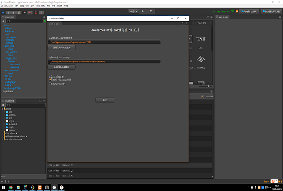

#** excel-to-db for Cocos Creator **


* Cocos Creator 编辑器扩展：实现 excel 导出成 .javascript 或者 .db  组件。

    *  javascript 其实就是 Cocos Creator 中可以直接require使用的js文件 
      
    *  db 其实就是 json 纯文本文件 


##插件使用
* 插件安装方法

    *  请参考 [扩展编辑器:安装与分享](http://www.cocos.com/docs/creator/extension/install-and-share.html) 文档。

* 使用环境

    *  首先从主菜单打开 excel-to-db 面板： `拓展->excel-to-db->open`。 会弹出如下面板
    

    * 项目目录结构类似
        * Progect
            * assets
                * resources
                    * EXCEL
            * EXCEL
        

* 插件导出流程

    * 点击按钮=》“选择导入excel文件夹”，选择原始excel配置文件路径<br>
      注意这里尽量用默认路径，即项目根目录下的EXCEL文件夹
    
    * 选择excel导出类型
        * 1：导出到一个JavaScript文件中，即最后会吧全部配置导出到 
          .\assets\resources\EXCEL\EXCEL_TO_DB_VO.js 文件中
            * 优点：简单方便，任何地方require("EXCEL_TO_DB_VO") 这个类即可使用
            * 缺点：会一次性吧所有配置加载进内存，而且本身 Cocos Creator 在打包app，
                也会吧所有js文件合并到一个文件中
        * 2：导出到多个db文件，最后会吧配置一个一个的导入到对应名的 .db文件中</br>
        .\assets\resources\EXCEL\*.db 
            * 优点：可以自由的管理控制加载不同配置，适合大型项目</br>
                 比如我在战斗场景，我只需要战斗场景的数据

    * excel定义各列的字段名是第几行,默认是第六行
        * 注意：定义字段名+1 行，即是定义每列的类型（类型目前int32 string double） 
        
    * 确定
        * 点击=>确定，即可在对应 .\assets\resources\EXCEL\ 查看到对应的导出文件


##游戏中使用流程
####API
---


---


####代码调用
* 无论你选择的是哪种导出方式，在运行游戏中使用方法是一致的
* 如果你是通过一次性导出js方式导出的话，直接不要load，第二步 《使用 *.xlsx 的数据》 即可

```javascript
    
    //import EXCEL_TO_DB 脚本
    var EXCEL_TO_DB = require('EXCEL_TO_DB');

   

    //1: 《 加载 *.xlsx 的数据 》
    var callback =  function(data){
        console.log(JSON.stringify(data));
    }
    EXCEL_TO_DB.loadAll(callback);//一次性加载所有
    EXCEL_TO_DB.loadFromFile("ShopConfig",callback);//加载单个ShopConfig.db文件
    EXCEL_TO_DB.loadFromFile(["ShopConfig","GameConfig"],callback);//以数组方式加载多个db文件


    //2:《 使用 *.xlsx 的数据 》
    var allConfig = EXCEL_TO_DB.getAll();
    var ShopConfig = allConfig["ShopConfig"]
    
    var ShopConfig = EXCEL_TO_DB.getFromFile("ShopConfig");//调用 getFromFile 获取 
    console.log(JSON.stringify(ShopConfig)); //打印看看格式 

    var arrConfig = EXCEL_TO_DB.getFromFile(["ShopConfig","GameConfig"]);//以数组方式获取多个
    var ShopConfig = arrConfig["ShopConfig"]

   

```


##问题
* 选择文件夹路径变成 C:\fakepath\ftp.txt
    *  解决方法
    在浏览器中：工具 -> Internet选项 -> 安全 -> 自定义级别 -> 找到“其他”中的“将本地文件上载至服务器时包含本地目录路径”，选中“启用”，然后重启浏览器即可。


##有问题反馈
在使用中有任何问题，欢迎反馈给我，可以用以下联系方式跟我交流

* 邮件(antwand#sina.com, 把#换成@)


##关于作者

```javascript
  var antwand = {
    nickName  : "antwand",
    email:"antwand@sina.com"
    site : "http://antwand.com"
  }
```

